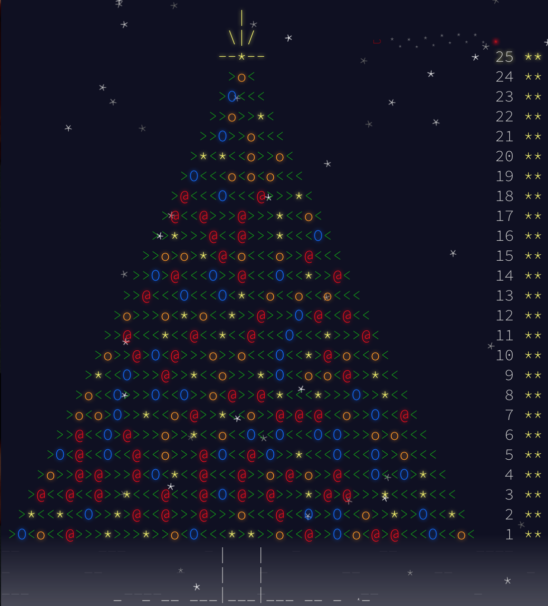

# advent-of-rust
My solutions to [Advent of Code](http://adventofcode.com) challenges, written in [Rust](https://www.rust-lang.org).

## Methodology
I found these challenges to be a good opportunity for getting acquainted with a new language. Therefore I decided to do all of them using Rust, which is a modern alternative to my currently favourite language, C++.

As the primary goal is on learning as many new concepts as possible, I have decided to follow two main principles:
* Whenever the problem is solvable in a better way than bruteforce, I will strive to implement the better approach.
* My goal is for the final revision to these solutions to reference nothing but the Rust standard library, as I would like to try and implement as many of the algorithms myself without relying on external APIs.

With that in mind, here is a list of the challenges where I have particularly applied the above:
* **Day 6**, where I have implemented the Quadtree data structure with lazy propagation for more efficient range updates. This reduces the worst-case cost of updating from O(n^2) to O(n).
* **Day 7**, where I have first implemented the graph data structure. This might sound simple, but Rust's borrows checker has made it a very demanding task, requiring usage of dynamic borrowing structures such as RefCell.
* **Day 9**, where I have implemented a dynamic programming approach to solving the shortest/longest Hamiltonian path problems, reducing the complexity from O(n!) to O(2^n n^2).
* **Day 12**, where I have implemented a custom parser (taking into account just the data required for solving the problem), rather than using an external JSON library.
* **Day 13**, where I have implemented a dynamic programming approach to solving the Travelling Salesman Problem (similarly to Day 9).
* **Day 17**, where I have implemented a dynamic programming approach to solving the counting and weighted variants of the Subset Sum problem, reducing the complexity from O(2^n) to O(n * sum).
* **Day 18**, where I have implemented a slightly optimised approach to Conway's Game of Life (examining only the neighbourhood of the recently changed cells). I am considering attempting the Hashlife algorithm at some point.
* **Day 19**, where I have implemented a modification of the Cocke-Younger-Kasami (CYK) algorithm for computing the parse length. In the given grammar, all parse lengths are equal, so the algorithm was adequate.
* **Day 25**, where I have implemented modular exponentiation by squaring to compute the required matrix element in O(log n).

## Final result

## TODOs

* Write my own implementation of MD5 for Day 4, to avoid an external dependency.
* Consider implementing Hashlife for Day 18.
* Add further checks to my algorithm for Day 24, so it can handle inputs which cannot always be split into k parts.

## License
MIT
